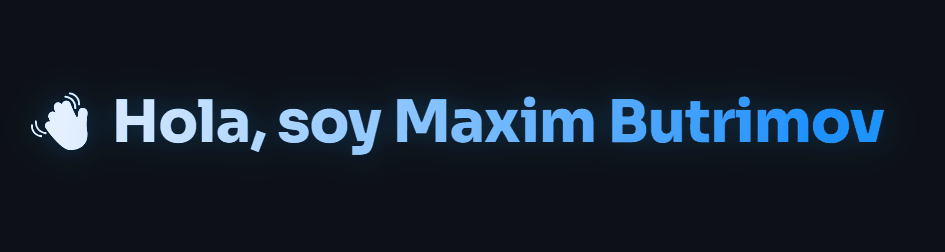

<!-- HEADER -->
<div align="center">
  
</div>

<div align="center">

  [](https://git.io/typing-svg)

</div>

<div align="center">
  <a href="https://portfolio-zeta-tawny-46.vercel.app/">
    
  </a>
  &nbsp;
</div>

---

## ⚡ Elevator Pitch

<p align="center">
  Desarrollador Full Stack Junior con <strong>experiencia profesional real en automatización de procesos</strong>, adquirida en Segula Technologies, donde migré flujos de trabajo del ecosistema Microsoft a Google Workspace y eliminé tareas manuales mediante scripting. Formado en el Grado Superior de Desarrollo de Aplicaciones Multiplataforma (DAM), combino esa base técnica con proyectos personales en <strong>desarrollo web y ciberseguridad defensiva</strong>, con una orientación clara hacia el backend y el full stack.
</p>

---

## 🧠 Sobre mí
```text
🎓  Graduado en Desarrollo de Aplicaciones Multiplataforma (DAM)
🏢  Experiencia profesional en automatización — Segula Technologies
🌍  Con base en Madrid, España
⚙️  Trabajo con Python, JavaScript y Java aplicando POO
🗄️  Gestión de bases de datos relacionales (MySQL) y NoSQL (MongoDB)
🐧  Cómodo en entornos Linux y Windows
🔐  Ampliando conocimientos en ciberseguridad defensiva (Hack The Box)
🤝  Resuelvo problemas de forma estructurada y me adapto rápido a nuevas tecnologías
📈  En aprendizaje constante: Java Programming Masterclass (Udemy) y Ciberseguridad Práctica (HTB)
```

> *Creo en escribir código que no necesite explicación: claro, estructurado y mantenible.*

---

## 🛠️ Stack Tecnológico

### 💻 Lenguajes

<p>
  
</p>

### 🗄️ Bases de datos

<p>
  
</p>

### ☁️ Plataformas & Herramientas

<p>
  
</p>

### 🔧 Conceptos & Prácticas

<p>
  
  
  
  
</p>

---

## 💼 Experiencia Profesional

<table>
  <tr>
    <td>
      <h3>🏢 Segula Technologies <sub><sup>· Desarrollador de Automatizaciones · Mar. 2026 – May. 2026</sup></sub></h3>
      <p>Segula Technologies es una firma de ingeniería global. En mi rol, contribuí a la digitalización y modernización de procesos internos del equipo.</p>
      <ul>
        <li>☁️ <strong>Migración de procesos automatizados</strong> desde el ecosistema Microsoft (SharePoint, Excel, Power Automate) hacia Google Workspace, asegurando continuidad operativa</li>
        <li>⚙️ <strong>Desarrollo de scripts y automatizaciones</strong> en Python, JavaScript y Google Apps Script, integrando APIs de Google para eliminar tareas manuales repetitivas</li>
        <li>📊 Diseño de soluciones centradas en <strong>Google Sheets como hub de datos</strong>, conectando herramientas del entorno empresarial</li>
        <li>🔍 Análisis de flujos de trabajo internos, identificación de cuellos de botella y propuesta de mejoras técnicas</li>
        <li>🛠️ Mantenimiento y evolución de automatizaciones en producción, aplicando criterios de calidad y mantenibilidad del código</li>
      </ul>
    </td>
  </tr>
</table>

---

## 📌 Proyectos Personales

<div align="center">

| Proyecto | Stack | Descripción |
|:---------|:-----:|:------------|
| 🎮 **JumpQuest** | JavaScript · Phaser 3 · HTML5 | Videojuego de plataformas 2D desarrollado íntegramente con Phaser 3. Sistema de físicas propio, detección de colisiones, gestión de estados de juego y arquitectura de escenas modular. |
| 🔐 **Aegira** | Python · IA · Redes · Ciberseguridad | Aplicación de auditoría defensiva de redes Wi-Fi. Analiza redes propias/autorizadas, detecta vulnerabilidades y genera informes de riesgo. Integra un módulo de IA que explica riesgos y propone hardening, además de un asistente conversacional. *(En desarrollo)* |

</div>

> ⭐ *Prefiero publicar menos proyectos pero bien documentados, que muchos repositorios a medias.*

---

## 💡 Mentalidad de Trabajo

No soy desarrollador de copiar y pegar. Antes de escribir código, entiendo el **problema real** detrás de la tarea. Me hago preguntas como: *¿esto escala?, ¿otra persona puede entenderlo sin mi ayuda?, ¿estoy resolviendo la causa raíz o solo el síntoma?*

- Aprendo de forma deliberada: no solo uso herramientas, **entiendo cómo funcionan por dentro**
- Vengo del mundo de la automatización, así que pienso en eficiencia y reducción de errores desde el diseño
- La ciberseguridad no es solo un interés — es parte de cómo pienso el código, con mentalidad defensiva
- Me adapto rápido a nuevas tecnologías y entornos de trabajo

> *La diferencia entre un buen desarrollador y uno excelente no está en cuántas tecnologías sabe — está en cómo piensa cuando las cosas se complican.*

---

## 🎓 Formación

- **Grado Superior en DAM** (Desarrollo de Aplicaciones Multiplataforma) · MEDAC · 2024 – 2026
- **Bachillerato** · IES Juan Gris · 2022 – 2024
- **Java Programming Masterclass** · Udemy · En curso
- **Ciberseguridad Práctica** · Hack The Box · En curso

---

## 📬 Contacto

<div align="center">

  ¿Tienes un proyecto interesante, una oportunidad o simplemente quieres hablar de tecnología?

  <br/>

  [](https://portfolio-zeta-tawny-46.vercel.app/)
  &nbsp;
  [](https://www.linkedin.com/in/maxim-butrimov-949958337/)
  &nbsp;
  [](mailto:maxim.butrimov@gmail.com)
  &nbsp;
  [](https://github.com/MaximButrimov)

  <br/><br/>

  

</div>

---

<div align="center">
  <i>"El buen código no se escribe para las máquinas — se escribe para las personas que lo leerán después."</i>
</div>


